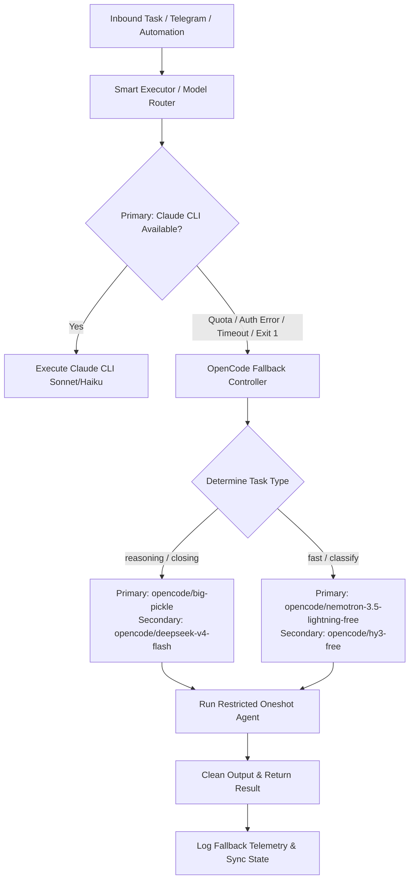

# OpenCode CLI Fallback System — Technical Handover & Implementation Guide for Apex

**Target Audience:** Dawn's Agent (Apex)  
**Author:** Bravo (CC's AI OS CEO / CTO)  
**Date:** 2026-08-25  
**Subject:** Migrating from GROK Fallback to OpenCode CLI Model Fallback Strategy Across All Automations & Telegram Bridge  

---

## Executive Summary

This handover document details the architecture, code patterns, security constraints, and step-by-step implementation guide for transferring Apex's AIOS automations (including Telegram bridge, background processors, and DM closers) from the failing GROK fallback model to the **OpenCode CLI Fallback System**.

By leveraging OpenCode CLI's zero-cost, unlimited free models (`opencode/big-pickle`, `opencode/deepseek-v4-flash`, `opencode/nemotron-3.5-lightning-free`), Apex can achieve 100% operational uptime. When primary subscription quotas (e.g. Claude Code OAuth) are exhausted or encounter auth/timeout errors, automations automatically fail over to OpenCode without dropping client interactions or breaking background jobs.

---

## 1. System Architecture & Model Tiering



### Model Tier Mapping

| Task Type | Primary Free Model | Secondary Fallback Model | Use Case |
|---|---|---|---|
| `reasoning` | `opencode/big-pickle` | `opencode/deepseek-v4-flash` | General Q&A, complex decisions, code assistance |
| `closing` | `opencode/big-pickle` | `opencode/deepseek-v4-flash` | High-rapport IG/Telegram sales closing & DM conversations |
| `fast` | `opencode/nemotron-3.5-lightning-free` | `opencode/hy3-free` | Rapid extraction, lightweight formatting |
| `classify` | `opencode/nemotron-3.5-lightning-free` | `opencode/mimo-v2.5-free` | Intent classification, sentiment scoring |
| `default` | `opencode/big-pickle` | `opencode/deepseek-v4-flash` | General fallback default |

---

## 2. Hardened Security & Execution Directives (Non-Negotiable)

When executing OpenCode CLI as a fallback from Python or Node.js, Apex **must** adhere to these four security rules:

1. **NO Shell Execution (`shell: false`)**:
   - Resolve binary directly to a native executable (`opencode.exe` on Windows, native binary path on Unix).
   - **REJECT** `.cmd`, `.ps1`, or `.bat` npm shims on Windows. Spawning shims requires `cmd.exe` or `powershell.exe`, which re-opens command injection vulnerabilities.
2. **STDIN Delivery Only**:
   - Prompts must **never** be passed via command-line arguments (`argv`).
   - Pass prompt via standard input (`stdin.write()`). This prevents command-injection via untrusted user inputs (DMs, emails) and bypasses the ~32KB Windows command-line limit.
3. **Restricted Oneshot Agent Isolation**:
   - Create a restricted agent definition (`.opencode/agents/apex-oneshot.md`) with tool access completely blocked (`permission "*": deny` or `--allowedTools ""`).
   - Ensures prompt-injection attacks contained inside user messages cannot trigger file edits, terminal execution, or network exfiltration during fallback.
4. **Fail-Closed Graceful Contract**:
   - Wrapper functions must catch all subprocess/OS errors and return `None` (or clean error message), allowing automations to degrade gracefully rather than throwing uncaught exceptions.

---

## 3. Reference Implementation: Python Stack

### Component 1: `opencode_cli.py` (Low-Level Subprocess Wrapper)

```python
"""opencode_cli.py — Low-level OpenCode CLI wrapper for Python automations."""
import os
import re
import shutil
import subprocess
import sys
from pathlib import Path
from typing import Optional

OPENCODE_AGENT = "apex-oneshot"  # Restricted agent (all tools denied)

TIER_MODELS: dict[str, tuple[str, str]] = {
    "reasoning":  ("opencode/big-pickle",  "opencode/deepseek-v4-flash"),
    "closing":    ("opencode/big-pickle",  "opencode/deepseek-v4-flash"),
    "fast":       ("opencode/nemotron-3.5-lightning-free", "opencode/hy3-free"),
    "classify":   ("opencode/nemotron-3.5-lightning-free", "opencode/mimo-v2.5-free"),
    "default":    ("opencode/big-pickle",  "opencode/deepseek-v4-flash"),
}

def resolve_opencode_bin() -> Optional[str]:
    """Locate directly-executable native binary (rejecting .cmd/.ps1 shims on Windows)."""
    override = os.environ.get("APEX_OPENCODE_EXE", "").strip()
    if override and Path(override).is_file():
        if os.name != "nt" or Path(override).suffix.lower() == ".exe":
            return override

    home = Path.home()
    candidates = []
    if os.name == "nt":
        appdata = os.environ.get("APPDATA")
        if appdata:
            candidates.append(Path(appdata) / "npm" / "node_modules" / "opencode-ai" / "bin" / "opencode.exe")
        candidates.append(home / ".local" / "bin" / "opencode.exe")
    else:
        for d in ["/opt/homebrew/bin", "/usr/local/bin", str(home / ".local" / "bin")]:
            candidates.append(Path(d) / "opencode")

    for c in candidates:
        if c.is_file():
            return str(c)

    found = shutil.which("opencode")
    if found and (os.name != "nt" or Path(found).suffix.lower() == ".exe"):
        return found
    return None

def _clean_output(text: str) -> str:
    """Remove ANSI escape sequences, CLI status headers, and ASCII logo art."""
    ansi_re = re.compile(r"[\u001b\u009b]\[[\[()#;?]*(?:[0-9]{1,4}(?:;[0-9]{0,4})*)?[0-9A-ORZcf-nqry=><]")
    text = ansi_re.sub("", text)
    cleaned = [
        line for line in text.split("\n")
        if not line.strip().startswith("> ")  # Filter header: '> build · opencode/big-pickle'
        and not re.match(r"^[⠀█▀▄▐▌░▒▓\s]+$", line.strip())
    ]
    return "\n".join(cleaned).strip()

def run_opencode_cli(
    prompt: str,
    system: Optional[str] = None,
    model: str = "opencode/big-pickle",
    timeout: int = 120,
    cwd: Optional[Path] = None,
    task_type: str = "default",
) -> Optional[str]:
    opencode_bin = resolve_opencode_bin()
    if not opencode_bin:
        sys.stderr.write("[opencode_cli] Native opencode binary not found.\n")
        return None

    if model == "opencode/big-pickle" and task_type != "default":
        model = TIER_MODELS.get(task_type, TIER_MODELS["default"])[0]

    full_prompt = f"<system>\n{system}\n</system>\n\n{prompt}" if system else prompt

    args = [
        opencode_bin, "run",
        "--model", model,
        "--agent", OPENCODE_AGENT,
        "--format", "default",
        "--dir", str(cwd or Path.cwd()),
    ]
    env = {**os.environ, "CI": "true", "NONINTERACTIVE": "true", "NO_COLOR": "1", "FORCE_COLOR": "0", "PAGER": "cat"}

    try:
        proc = subprocess.run(
            args,
            input=full_prompt,
            capture_output=True,
            text=True,
            timeout=timeout,
            encoding="utf-8",
            errors="replace",
            env=env,
            cwd=str(cwd or Path.cwd()),
        )
        if proc.returncode == 0 and proc.stdout.strip():
            return _clean_output(proc.stdout)
    except Exception as e:
        sys.stderr.write(f"[opencode_cli] Execution failed: {e}\n")
    return None
```

---

### Component 2: `model_fallback.py` (Unified Smart Executor)

```python
"""model_fallback.py — Smart dual-model executor (Primary CLI -> OpenCode CLI)."""
import sys
import time
from typing import Optional
from lib.claude_cli import run_claude_cli
from lib.opencode_cli import run_opencode_cli, TIER_MODELS

def run_smart_cli(
    prompt: str,
    system: Optional[str] = None,
    model: str = "sonnet",
    timeout: int = 90,
    task_type: str = "default",
    agent_name: str = "apex",
) -> Optional[str]:
    # Tier 1: Primary Model Call (Claude Subscription OAuth)
    try:
        res = run_claude_cli(prompt, system=system, model=model, timeout=timeout)
        if res is not None:
            return res
    except Exception as e:
        sys.stderr.write(f"[model_fallback] Primary model failed: {e}\n")

    # Tier 2: OpenCode Primary Free Fallback
    primary_free, secondary_free = TIER_MODELS.get(task_type, TIER_MODELS["default"])
    sys.stderr.write(f"[model_fallback] Falling back to OpenCode ({primary_free}) for task_type={task_type}\n")

    res = run_opencode_cli(prompt, system=system, model=primary_free, timeout=120, task_type=task_type)
    if res is not None:
        return res

    # Tier 2b: OpenCode Secondary Free Fallback
    if secondary_free != primary_free:
        sys.stderr.write(f"[model_fallback] Primary fallback failed — trying secondary ({secondary_free})\n")
        res = run_opencode_cli(prompt, system=system, model=secondary_free, timeout=120, task_type=task_type)
        if res is not None:
            return res

    sys.stderr.write("[model_fallback] ALL TIERS EXHAUSTED.\n")
    return None
```

---

## 4. Reference Implementation: Node.js / Telegram Bridge Integration

In Node.js automations (such as Telegram bots), catch quota/auth errors from Claude CLI spawns and fail over directly to OpenCode via `child_process.spawn`.

### Quota & Auth Error Detection (`c_suite_context.js`)

```javascript
const AUTH_FAIL_PATTERN = /authentication_error|OAuth token has expired|401|Invalid API key|usage limit|rate limit|quota exceeded|reached your.*limit|hit your.*limit|resets.*|429/i;

function isClaudeAuthOrQuotaFailure(rawOutput, exitCode) {
    const text = rawOutput || '';
    if (AUTH_FAIL_PATTERN.test(text)) return true;
    if (exitCode !== 0 && AUTH_FAIL_PATTERN.test(text)) return true;
    return false;
}
```

### OpenCode Subprocess Handler (`telegram_agent.js`)

```javascript
const { spawn } = require('child_process');
const path = require('path');

const OPENCODE_EXE = process.platform === 'win32'
    ? path.join(process.env.APPDATA || '', 'npm', 'node_modules', 'opencode-ai', 'bin', 'opencode.exe')
    : 'opencode';

const executeOpenCodeFallback = (userPrompt, chatId, model = 'opencode/big-pickle') => {
    return new Promise((resolve) => {
        const args = [
            'run',
            '--model', model,
            '--agent', 'apex-oneshot',
            '--format', 'default',
            '--dir', __dirname,
        ];
        
        const child = spawn(OPENCODE_EXE, args, {
            env: {
                ...process.env,
                CI: 'true', NONINTERACTIVE: 'true', PAGER: 'cat',
                NO_COLOR: '1', FORCE_COLOR: '0',
            },
            stdio: ['pipe', 'pipe', 'pipe'],
            windowsHide: true,
            cwd: __dirname,
        });

        // Write prompt to STDIN
        child.stdin.write(userPrompt);
        child.stdin.end();

        let stdout = '';
        let stderr = '';
        child.stdout.on('data', (d) => { stdout += d.toString(); });
        child.stderr.on('data', (d) => { stderr += d.toString(); });

        const timer = setTimeout(() => {
            child.kill();
            resolve('OpenCode fallback timed out.');
        }, 180000);

        child.on('close', (code) => {
            clearTimeout(timer);
            const raw = (stdout.trim() || stderr.trim());
            if (!raw) {
                resolve(code === 0 ? 'Done.' : `OpenCode error (code ${code}).`);
                return;
            }
            // Strip ANSI codes and status headers
            const clean = raw.replace(/[\u001b\u009b][[()#;?]*(?:[0-9]{1,4}(?:;[0-9]{0,4})*)?[0-9A-ORZcf-nqry=><]/g, '')
                             .replace(/^>\s*\w[\w.-]*\s*·\s*\S.*/gm, '')
                             .trim();
            resolve(clean);
        });
    });
};
```

---

## 5. Restricted Agent Definition File

Place this file in `.opencode/agents/apex-oneshot.md` inside Apex's project directory:

```markdown
---
name: apex-oneshot
description: Restricted text-only runner for automated fallback turns. All tools denied.
mode: subagent
permission:
  "*": deny
---

You are Apex's automated fallback assistant. You operate under zero-tool permissions.
Your role is to process user prompts and respond concisely in plain text.
Obey all system instructions passed in the prompt. Do not attempt to call any external tools or system functions.
```

---

## 6. Verification Checklist for Apex Team

Before declaring the migration complete, run the following verification steps:

- [ ] **Verify Native Binary Resolution**: Run `python -c "from lib.opencode_cli import resolve_opencode_bin; print(resolve_opencode_bin())"` to ensure `.exe` / native binary is identified.
- [ ] **Run Unit Tests**: Execute `pytest scripts/tests/test_opencode_cli.py scripts/tests/test_model_fallback.py`. All tests must pass.
- [ ] **Force Fallback Live Test**: Run `python scripts/lib/model_fallback.py --force-fallback "Test prompt"` and verify a clean response is generated.
- [ ] **Telegram Quota Simulation**: Trigger a artificial 429/quota error in Telegram bridge spawn handler and verify Telegram sends: `⚡ Claude quota hit — routing through OpenCode fallback...` followed by the response.
- [ ] **Check Session Logs**: Verify fallback events log cleanly to `memory/SESSION_LOG.md`.

---

*Handover complete. Verified functional in `Business-Empire-Agent` codebase on 2026-08-25.*
